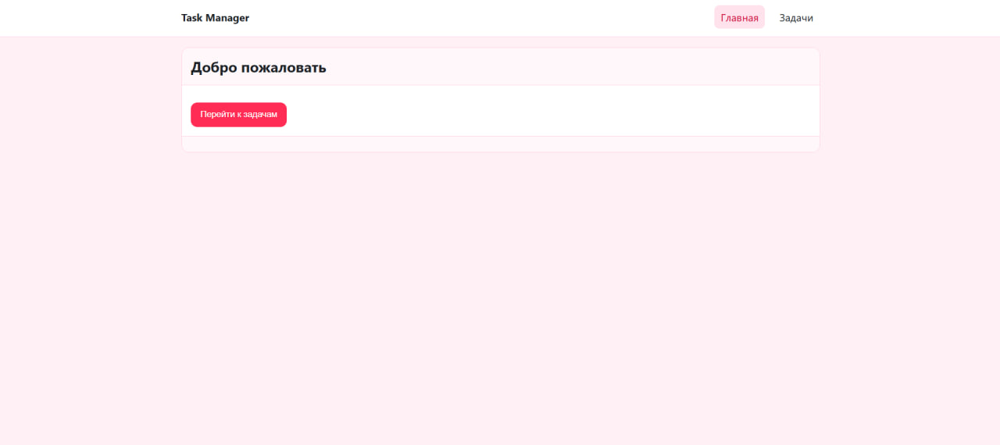
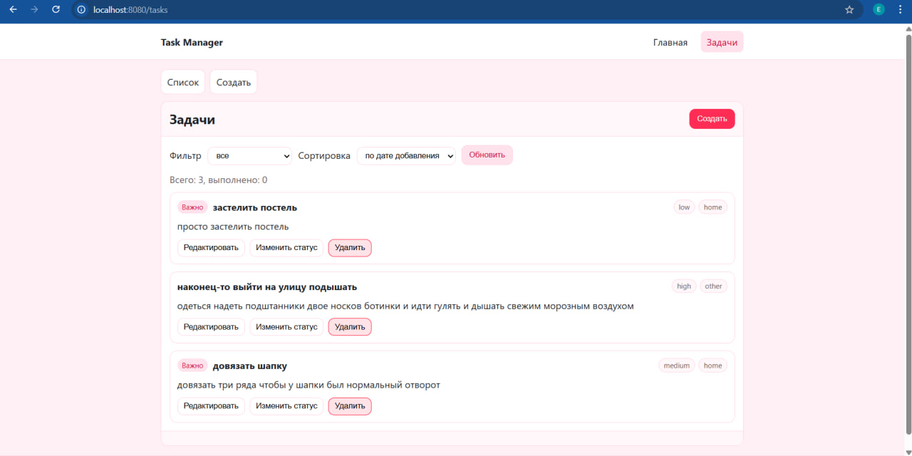
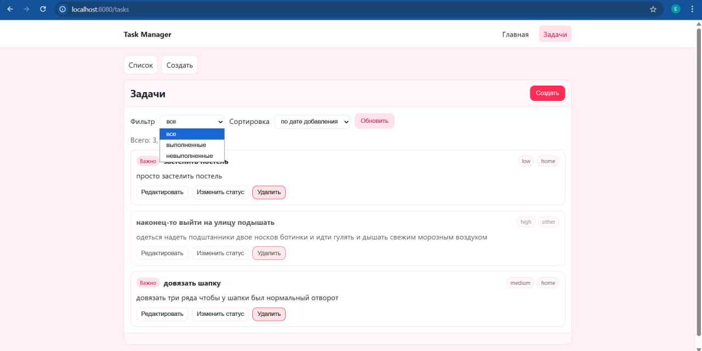
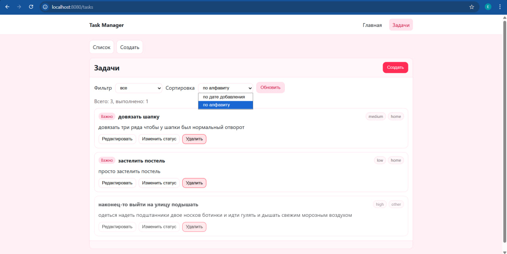
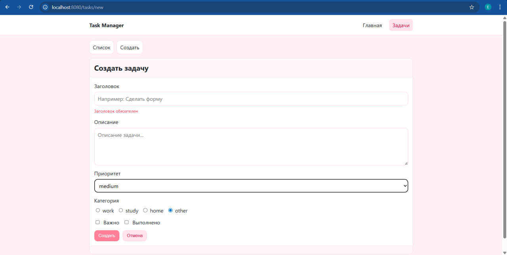
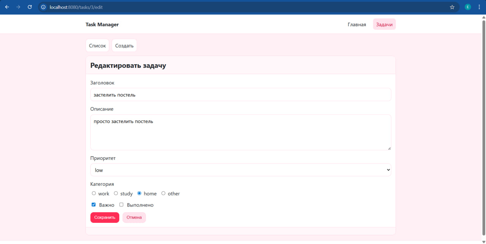
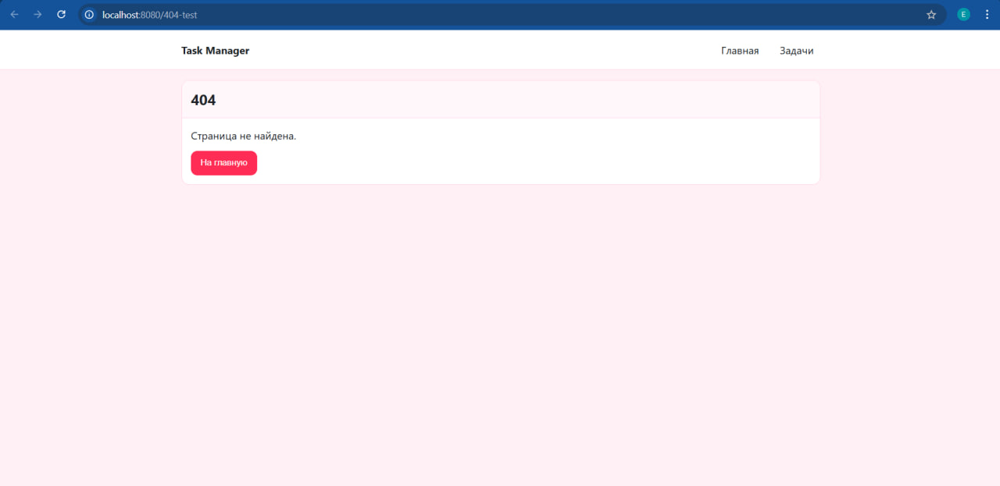

# Отчёт по проекту «Менеджер задач» (Task Manager)

## 1. Титульная часть
- Автор: Ева Тажибаева
- Группа: Р3468
- Дата: 08.01.2026
- Название работы: SPA-приложение «Менеджер задач» (Vue 3 + FastAPI)
- Репозиторий: https://github.com/0Tzhbeva0/task-manager

## 2. Цель работы
Освоить фундаментальные возможности Vue 3 (реактивность, формы, компоненты, слоты, маршрутизация), взаимодействие с сервером (REST API), базовую серверную разработку на Python (FastAPI) и контейнеризацию (Docker).

## 3. Реализованный функционал

### Клиентская часть (Vue 3)
- Страницы:
  - `/` — приветственный экран с кнопкой перехода к задачам
  - `/tasks` — список задач
  - `/tasks/new` — создание задачи
  - `/tasks/:id/edit` — редактирование задачи
  - `404` — страница не найдена
- Маршрутизация:
  - вложенные маршруты (`/tasks` → list/new/edit)
  - именованные маршруты (`home`, `tasks.list`, `tasks.new`, `tasks.edit`)
  - программная навигация через `router.push(...)`
- Список задач:
  - вывод массива через `v-for`
  - условный рендеринг пустого списка через `v-if`
  - фильтрация по статусу (все/выполненные/невыполненные)
  - сортировка (по дате добавления/по алфавиту)
- Компоненты:
  - `TaskList.vue`, `TaskItem.vue`, `TaskForm.vue`
  - `AppHeader.vue`, `AppFooter.vue`
  - `LayoutCard.vue` — компонент со слотами
- Слоты:
  - обычный + именованные (`LayoutCard`: `header`, `footer`, default)
  - слот с ограниченной областью видимости (scoped slot) в `TaskList`: `summary` (передаются `total` и `completed`)
- Формы:
  - поля: input/textarea/select/radio/checkbox
  - `v-model` с модификаторами `trim`, `lazy`
  - валидация через `computed`
- `computed`/`watch`:
  - `computed`: фильтрация и сортировка списка задач
  - `watch`: реакция на изменения фильтров
- Дизайн:
  - интерфейс выполнен в ало-розовой палитре (CSS variables)

### Серверная часть (Python, FastAPI)
- CRUD API:
  - `GET /api/tasks`
  - `GET /api/tasks/{id}`
  - `POST /api/tasks`
  - `PUT /api/tasks/{id}`
  - `DELETE /api/tasks/{id}`
- Хранение данных: JSON файл `tasks.json` (в Docker — в volume `/app/data/tasks.json`)
- Логика записи: при создании/обновлении/удалении файл перезаписывается, чтобы можно было смотреть содержимое вручную.

## 4. Скриншоты интерфейса









## 5. Пример кода

```vue
<TaskList :tasks="sortedTasks" @delete="removeTask" @toggle="toggleTaskStatus" @edit="editTask">
  <template #summary="{ total, completed }">
    <div>Всего: {{ total }}, выполнено: {{ completed }}</div>
  </template>
</TaskList>
```

## 6. Пример данных (tasks.json)

```json
[
  {
    "id": 1,
    "title": "Придумать стихотворение",
    "description": "Сделать TaskItem.vue",
    "priority": "high",
    "category": "study",
    "important": true,
    "completed": false,
    "created_at": "2026-01-08T12:00:00Z",
    "updated_at": "2026-01-08T12:00:00Z"
  }
]
```

## 7. Инструкция по запуску (Docker)

```bash
docker compose build
docker compose up
```

- Frontend: http://localhost:8080
- Backend: http://localhost:8000

## 8. Выводы
Изучены основы Vue 3 (компоненты, реактивность, формы, слоты, маршрутизация), взаимодействие с REST API, основы FastAPI и запуск проекта в Docker.
